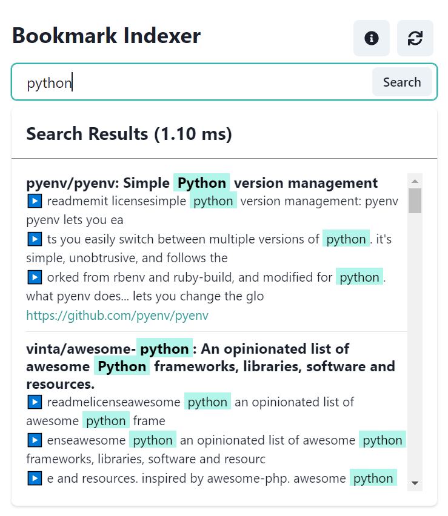

# bookmark-indexer
A minimal chrome extension for full-text searching of bookmarked website content. Developed with React + Plasmo + Flexsearch.



Features:
* Can search through bookmark titles and webpage text content (requires pre-scraping)
* Near-instant search (as tested with 2000 bookmarks) thanks to [Flexsearch](https://github.com/nextapps-de/flexsearch)
* All data is stored locally
* Manually re-sync your bookmarks to index new content and purge old content
* Type "IMUSTCOMMITSUDOKU" (no quotes) to reveal a 'nuke' button to reset your scraped data.
This extension allows the user to search through their bookmarks, including webpage text content (requires scraping beforehand). It'll

Limitations:
* Scraping process requires opening temporary pinned tabs in order to scrape, and may take a long time to execute for the first time
* For webpages that may have complex JS-based rendering or little text content, those bookmarks aren't indexed
* Scraping multiple times will go over aforementioned unsaved bookmarks
* Only HTML and PDF content is support, with latter only scraping 1st page and loading documents of 25 MB or less

Planned features:
* Custom Icon
* Save all bookmarks even if no text content is present
* Automatic synchronizing of bookmarks
* Configurable options
* Better UI synchronizing whenever popup is closed

## Getting Started

Run the development server:

```bash
npm run dev
```

Build the extension:

```bash
npm run build
```

